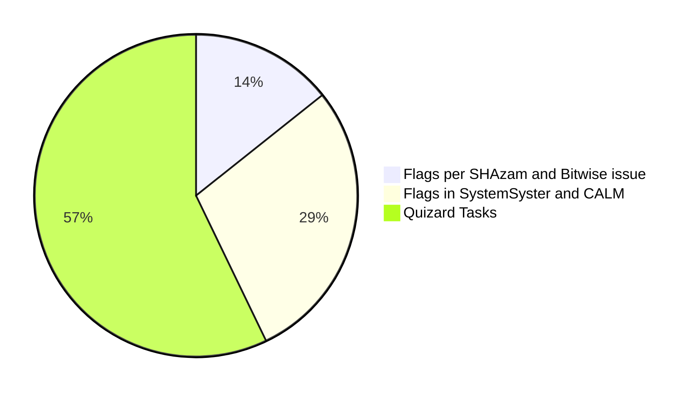

## Quizards of Trivially Place 
*Answer some final comprehension questions, ~bughunt the program input~ 
paste the Syster/CALM CTF codes somwhere, and earn ~eight~ four points!*

So far you've deconstructed the configuration of an unfamiliar hybrid network. You've seen how hash algorithms can disguise passwords under storage. Lastly, and most critical to the concept, you've observed the slightest changes in a file directory as highlighted by this cryptography method.

How can I guarantee this knowledge resonates with you...
> A pop-

POP QUIZ!! That's right.
```
C:\Users\xxx\Documents\ChadPackage> python Quizard.py
  .  .  .
```
```python
"Hash Cryptography Pop Quiz-ard" (omnicron 4.3.6)
# Line Number: 
'STAGE 1:' UNANSWERED | 'STAGE 2:' UNANSWERED |'STAGE 3:' UNANSWERED
'Revision Topics...' Salting, Checksums, Bus Topology, Ring Topology
'???' Bughunt hints coming soon

## Commands: ask [stage # / Revision Topic], exchange [hint buy], waver [attempt random flags]
finish
>> ask STAGE 1
"STAGE 1 query~~ User, what was the flag released from the CALM program?"
>> ask Salting
"Salting query~~ User, how would you respond to this query on salting?"
>> exchange xxx
"xxx query~~ User, this word does relate to a Bughunt hint.
  Here it is: blahblahblah"
>> waver yyy
"yyy waver~~ User, this is a flag! Your score has gone up!"
or "yyy waver~~ User, I do not understand... Your score remains the same."
>> finish
### This command will end your CTF. If hosted,
### I doubt nothing short of a time limit will stop you from retrying for a better score..!
### Are you sure you want to finish? [y/n]
>> y
"finish~~ User, here is your certificate:
  blahblahblah"
```
***
Welcome to the end of the CTF.


Here was roughly the magnitude of each task you did. Whatever you were able to accomplish, I hope it has been interesting!
This task was inspired by TryHackMe's "Introduction to Cryptography" room by Strategos. If you would like to explore broader applications of cryptogrpahy, this room is highly recommended.
Have a good day.
***
***
### Bibliography (using IEEE Citation for Engineering and IT)\
[1] Comparitech. “PowerShell Cheat Sheet”. Comparitech. 

https://cdn.comparitech.com/wp-content/uploads/2018/05/Comparitech-Powershell-cheatsheet-1024x695.jpeg. (accessed May 25, 2024).

[2] ComputerNetworkingNotes. “Configure Standard Access Control List Step by Step Guide”. ComputerNetworkingNotes.

https://www.computernetworkingnotes.com/ccna-study-guide/configure-standard-access-control-list-step-by-step-guide.html. (accessed May 20, 2024).

[3] Gunell, M. & Pankratyeva, A. “30 PowerShell Commands You Must Know (Cheat Sheet Included)”. Techopedia. 

https://www.techopedia.com/30-powershell-commands-you-must-know-cheat-sheet-included. (accessed May 25, 2024).

[4] Programmiz. “Bitwise Operators in C Programming”. Parewa Labs Pvt. 

https://www.programiz.com/c-programming/bitwise-operators (accessed May 29, 2024).

[5] Pulkitagarwal03pulkit. “Advantages and Disadvantages of Bus Topology”. GeeksforGeeks. 

https://www.geeksforgeeks.org/advantages-and-disadvantages-of-bus-topology/. (accessed June 5, 2024).

[6] Pulkitagarwal03pulkit. “Advantages and Disadvantages of ring topology”. GeeksforGeeks. 

https://www.geeksforgeeks.org/advantages-and-disadvantages-of-ring-topology/. (accessed June 5, 2024).

[7] Shadit13064. “Implementation of Bus Topology in Cisco”. GeeksforGeeks. 

https://www.geeksforgeeks.org/implementation-of-bus-topology-in-cisco/. (accessed June 5, 2024).

[8] Shadit13064. “Implementation of Ring Topology in Cisco”. GeeksforGeeks. 

https://www.geeksforgeeks.org/implementation-of-ring-topology-in-cisco/. (accessed June 5, 2024).

[9] Strategos. “Introduction to Cryptography”. TryHackMe.

https://tryhackme.com/r/room/cryptographyintro. (accessed May 18, 2024).
